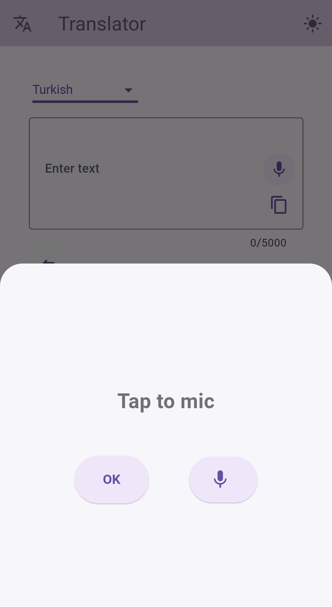
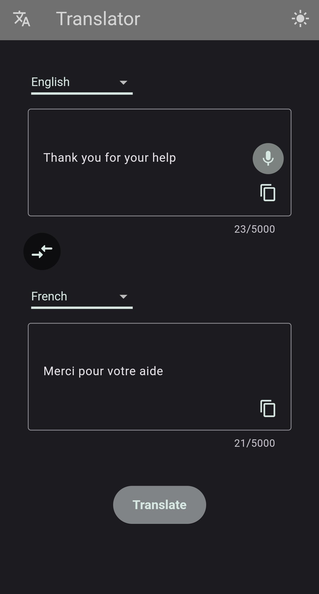
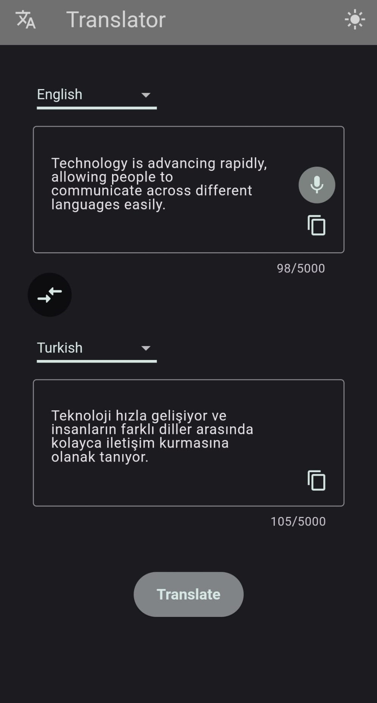
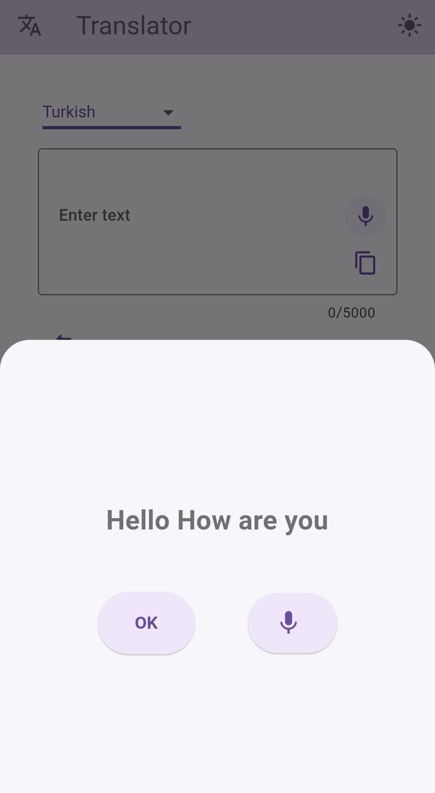
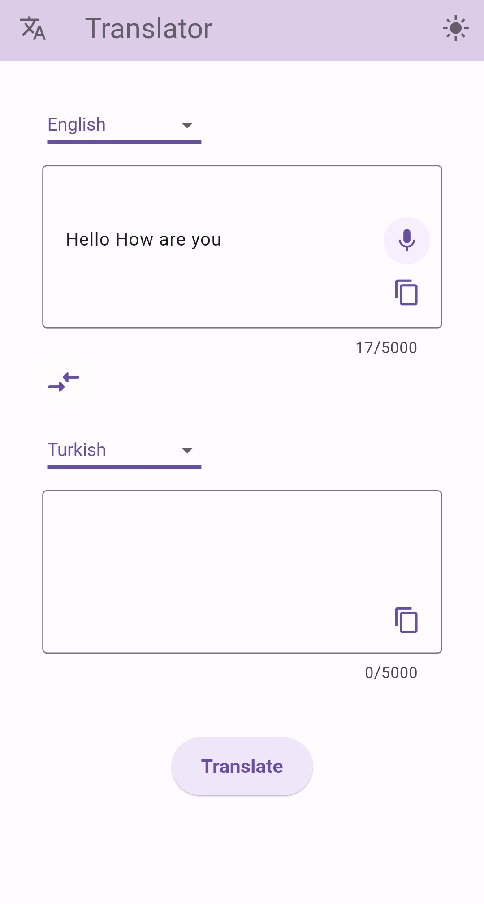
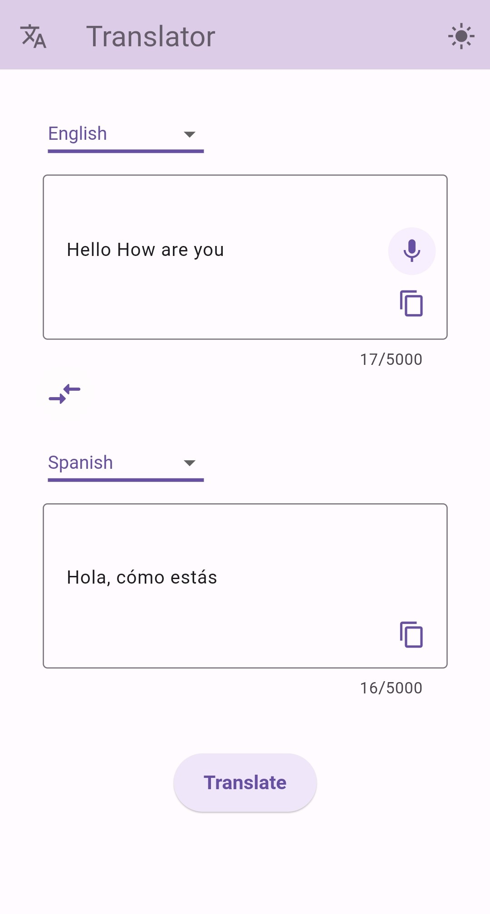

# Flutter Translator App 

This is a Flutter-based Translator App designed to translate text and provide speech-to-text functionality. Users can input text, select languages, and receive translations seamlessly. The app uses Cubit for state management, dependency injection for modularization. The app leverages the power of Cubit state management and dependency injection to ensure a clean and maintainable codebase.

## Feautures

- Text Translation: Translate text between various languages.
- Speech-to-Text: Recognize speech input and convert it into text.
- Dynamic Theme: Switch between light and dark themes.

## Usage

1. Start the app and choose your source and target languages. Reverse languages as needed.
2. Enter text manually or use the Speech-to-Text feature to input text by voice.
3. Press "Translate" to view the translated output.
4. Tap the copy icon to save the text to your clipboard.
5. Toggle between light and dark themes as desired.

## Screenshots
### Translator  

### Speech to Text 

### Example Translations

### Example Usage
1. Activate Speech-to-Text
Tap the mic button to enable speech-to-text functionality. Speak into the mic, and if you are satisfied with the input, press the "OK" button.

  

2. Edit Text and Select Languages
The recognized text will appear in the input field. You can edit the text and select the source and target languages and, if needed, reverse them.

  

3. Translate and Copy Text
Press the "Translate" button to see the translated text in the output field. To copy either the original or translated text, press the copy button.

  

## API Integration
The app retrieves data from [Free Google Translator](https://rapidapi.com/joshimuddin8212/api/free-google-translator) through Rapid API. Network requests are managed using Retrofit and Dio for efficient data handling and real-time translations.

## Architecture
This project uses Cubit for state management and dependency injection for modular design, allowing for improved testing and better separation of concerns.

## State Management
The app’s state management is handled using Cubit from the flutter_bloc package:

- TranslatorCubit: Manages the translation API call, loading, and result display.
- SpeechCubit: Handles speech-to-text functionality.
- ThemeCubit: Controls dynamic theme switching across the app.

## Acknowledgments

- Free Google Translator API : For providing translator functionality
- speech_to_text package : For recognizing speech input. ([speech_to_text-link](https://pub.dev/packages/speech_to_text)
- retrofit and dio packages: For network requests. ([retrofit-link](https://pub.dev/packages/retrofit),[dio-link](https://pub.dev/packages/dio)
- flutter_bloc package : For the Cubit state management. ([block-link](https://pub.dev/packages/flutter_bloc))
- get_it package : For dependency injection. ([get_it-link](https://pub.dev/packages/get_it))
- Flutter : For the framework.

## Contributing
Feel free to contribute by opening issues or submitting pull requests. 

## Contact
For questions or feedback, contact aslihanyoldas24@gmail.com

